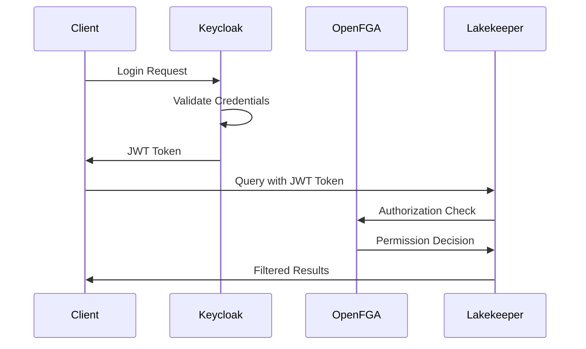
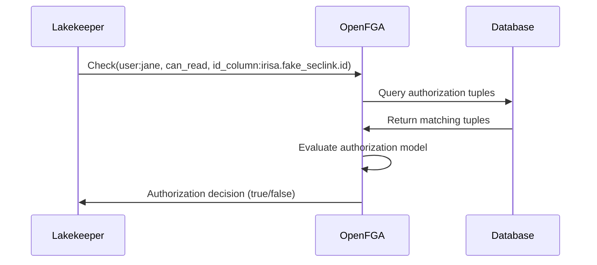

# Keycloak-OpenFGA Integration Guide

This document provides a comprehensive guide to understanding and implementing the integration between Keycloak (authentication) and OpenFGA (authorization) for fine-grained access control in Apache Iceberg data lakes.

## 🎯 Overview

The integration between Keycloak and OpenFGA creates a powerful fine-grained access control system where:
- **Keycloak** handles user authentication and identity management
- **OpenFGA** handles authorization decisions and permission enforcement
- **Lakekeeper** enforces the authorization decisions on Apache Iceberg tables

## 🏗️ Architecture Flow

```
┌─────────────┐    ┌─────────────┐    ┌─────────────┐    ┌─────────────┐
│   Client    │───▶│  Keycloak   │───▶│   OpenFGA   │───▶│  Lakekeeper │
│ (Trino/DB)  │    │ (Auth)      │    │ (Authz)     │    │ (Catalog)   │
└─────────────┘    └─────────────┘    └─────────────┘    └─────────────┘
                                                               │
                                                               ▼
                                                     ┌─────────────┐
                                                     │ Iceberg     │
                                                     │ Tables      │
                                                     └─────────────┘
```

### Detailed Integration Flow

1. **Client Request**: User/application makes a query request
2. **Authentication**: Keycloak validates user identity and issues JWT token
3. **Authorization Check**: OpenFGA evaluates permissions based on user and resource
4. **Query Execution**: Lakekeeper enforces permissions and executes query
5. **Response**: Filtered data returned based on user permissions

## 🔐 Authentication Flow (Keycloak)

### 1. User Authentication Process



### 2. JWT Token Structure

Keycloak issues JWT tokens with the following structure:

```json
{
  "sub": "cfb55bf6-fcbb-4a1e-bfec-30c6649b52f8",
  "preferred_username": "jane",
  "email": "jane@example.com",
  "realm_access": {
    "roles": ["default-roles-iceberg"]
  },
  "resource_access": {
    "lakekeeper": {
      "roles": ["jane-limited"]
    }
  },
  "aud": ["lakekeeper"],
  "iss": "http://keycloak:8080/realms/iceberg",
  "exp": 1735995780,
  "iat": 1735995480
}
```

### 3. Service Account Authentication

For machine-to-machine authentication:

```bash
# Get service account token
curl -X POST http://keycloak:8080/realms/iceberg/protocol/openid-connect/token \
  -d "grant_type=client_credentials" \
  -d "client_id=trino" \
  -d "client_secret=AK48QgaKsqdEpP9PomRJw7l2T7qWGHdZ"
```

## 🔑 Authorization Flow (OpenFGA)

### 1. Authorization Model Structure

OpenFGA uses a JSON-based model to define relationships:

```json
{
  "schema_version": "1.1",
  "type_definitions": [
    {
      "type": "user",
      "relations": {
        "can_read_limited_columns": {
          "union": {
            "child": [{ "this": {} }]
          }
        }
      },
      "metadata": {
        "relations": {
          "can_read_limited_columns": {
            "directly_related_user_types": [
              { "type": "user", "id": "jane" }
            ]
          }
        }
      }
    },
    {
      "type": "fake_seclink_table",
      "relations": {
        "can_read_all": { "this": {} },
        "can_read_limited": { "this": {} },
        "can_write": { "this": {} }
      },
      "metadata": {
        "relations": {
          "can_read_all": {
            "directly_related_user_types": [
              { "type": "user", "id": "service-account-trino" },
              { "type": "user", "id": "service-account-starrocks" },
              { "type": "user", "id": "service-account-duckdb" }
            ]
          },
          "can_read_limited": {
            "directly_related_user_types": [{ "type": "user", "id": "jane" }]
          }
        }
      }
    },
    {
      "type": "id_column",
      "relations": {
        "can_read": { "this": {} }
      },
      "metadata": {
        "relations": {
          "can_read": {
            "directly_related_user_types": [
              { "type": "user", "id": "jane" },
              { "type": "user", "id": "service-account-trino" },
              { "type": "user", "id": "service-account-starrocks" },
              { "type": "user", "id": "service-account-duckdb" }
            ]
          }
        }
      }
    }
  ]
}
```

### 2. Authorization Tuples

Specific permission assignments:

```json
{
  "tuple_keys": [
    {
      "user": "user:jane",
      "relation": "can_read_limited",
      "object": "fake_seclink_table:irisa.fake_seclink"
    },
    {
      "user": "user:jane",
      "relation": "can_read",
      "object": "id_column:irisa.fake_seclink.id"
    },
    {
      "user": "user:jane",
      "relation": "can_read",
      "object": "amount_column:irisa.fake_seclink.amount"
    }
  ]
}
```

### 3. Authorization Check Process



## 🔄 Integration Points

### 1. Token Validation

Lakekeeper validates JWT tokens from Keycloak:

```python
# Token validation in Lakekeeper
def validate_token(token):
    # Verify JWT signature with Keycloak public key
    # Extract user information
    # Check token expiration
    return user_info
```

### 2. User Identity Mapping

Map Keycloak users to OpenFGA users:

```python
# User mapping
keycloak_user = "jane"
openfga_user = f"user:{keycloak_user}"

# Service account mapping
keycloak_client = "trino"
openfga_user = f"user:service-account-{keycloak_client}"
```

### 3. Permission Evaluation

Lakekeeper queries OpenFGA for authorization decisions:

```python
# Authorization check
def check_permission(user, relation, object):
    response = openfga_client.check(
        store_id=STORE_ID,
        authorization_model_id=MODEL_ID,
        tuple_key={
            "user": f"user:{user}",
            "relation": relation,
            "object": object
        }
    )
    return response.allowed
```

## 📊 Access Control Patterns

### 1. Column-Level Security

```python
# Example: Check if user can access specific column
def can_access_column(user, table, column):
    return check_permission(
        user=user,
        relation="can_read",
        object=f"{column}_column:{table}.{column}"
    )
```

### 2. Row-Level Security

```json
{
  "type": "fake_seclink_row",
  "relations": {
    "can_read": {
      "directly_related_user_types": [
        { "type": "user", "id": "jane" }
      ]
    }
  }
}
```

### 3. Time-Based Access

```json
{
  "type": "time_based_access",
  "relations": {
    "can_read": {
      "directly_related_user_types": [
        { "type": "user" }
      ]
    }
  }
}
```

## 🔧 Configuration

### 1. Keycloak Configuration

#### Realm Settings
```json
{
  "realm": "iceberg",
  "enabled": true,
  "accessTokenLifespan": 300,
  "ssoSessionIdleTimeout": 1800,
  "ssoSessionMaxLifespan": 36000
}
```

#### Client Configuration
```json
{
  "clientId": "lakekeeper",
  "name": "Lakekeeper Catalog",
  "enabled": true,
  "publicClient": true,
  "standardFlowEnabled": true,
  "redirectUris": ["*"],
  "webOrigins": ["*"]
}
```

### 2. OpenFGA Configuration

#### Store Configuration
```json
{
  "id": "01K1WGBHWAGW2XVK4C7J4H3Y1V",
  "name": "lakekeeper",
  "created_at": "2025-08-05T06:57:58.668211Z"
}
```

#### Authorization Model
```json
{
  "schema_version": "1.1",
  "type_definitions": [
    {
      "type": "user",
      "relations": {
        "can_read_limited_columns": {
          "union": {
            "child": [{ "this": {} }]
          }
        }
      }
    }
  ]
}
```

## 🧪 Testing the Integration

### 1. Authentication Testing

```bash
# Test user authentication
curl -X POST http://keycloak:8080/realms/iceberg/protocol/openid-connect/token \
  -d "grant_type=password" \
  -d "client_id=trino" \
  -d "client_secret=AK48QgaKsqdEpP9PomRJw7l2T7qWGHdZ" \
  -d "username=jane" \
  -d "password=password123"
```

### 2. Authorization Testing

```bash
# Test OpenFGA authorization
curl -X POST http://openfga:8080/stores/$STORE_ID/check \
  -H "Content-Type: application/json" \
  -H "Authorization: Bearer $TOKEN" \
  -d '{
    "tuple_key": {
      "user": "user:jane",
      "relation": "can_read",
      "object": "id_column:irisa.fake_seclink.id"
    }
  }'
```

### 3. End-to-End Testing

```python
# Test complete flow
def test_integration():
    # 1. Get token from Keycloak
    token = get_keycloak_token("jane", "password123")
    
    # 2. Make query to Lakekeeper
    response = lakekeeper_query(
        token=token,
        sql="SELECT ID, Amount FROM irisa.fake_seclink LIMIT 5"
    )
    
    # 3. Verify results are filtered
    assert response.status_code == 200
    assert "Source" not in response.json()  # Should not include restricted columns
```

## 🔍 Monitoring and Debugging

### 1. Keycloak Monitoring

```bash
# Check Keycloak health
curl http://keycloak:8080/health

# View Keycloak logs
docker-compose logs keycloak

# Check realm configuration
curl -X GET http://keycloak:8080/admin/realms/iceberg \
  -H "Authorization: Bearer $ADMIN_TOKEN"
```

### 2. OpenFGA Monitoring

```bash
# Check OpenFGA health
curl http://openfga:8080/healthz

# View OpenFGA logs
docker-compose logs openfga

# List stores
curl -X GET http://openfga:8080/stores \
  -H "Authorization: Bearer $TOKEN"
```

### 3. Integration Monitoring

```bash
# Test token validation
curl -X POST http://keycloak:8080/realms/iceberg/protocol/openid-connect/userinfo \
  -H "Authorization: Bearer $TOKEN"

# Test authorization check
curl -X POST http://openfga:8080/stores/$STORE_ID/check \
  -H "Content-Type: application/json" \
  -H "Authorization: Bearer $TOKEN" \
  -d '{"tuple_key": {"user": "user:jane", "relation": "can_read", "object": "id_column:irisa.fake_seclink.id"}}'
```

## 🚨 Troubleshooting

### Common Integration Issues

1. **Token Validation Failures**
   - Check Keycloak public key configuration
   - Verify token expiration settings
   - Ensure proper audience claims

2. **Authorization Denied**
   - Verify OpenFGA tuples are deployed
   - Check user mapping between Keycloak and OpenFGA
   - Validate authorization model syntax

3. **Service Connectivity**
   - Check network connectivity between services
   - Verify service endpoints are accessible
   - Review Docker network configuration

### Debug Commands

```bash
# Check service connectivity
docker-compose exec keycloak curl http://openfga:8080/healthz
docker-compose exec openfga curl http://keycloak:8080/health

# Test token flow
TOKEN=$(curl -s -X POST http://keycloak:8080/realms/iceberg/protocol/openid-connect/token \
  -d "grant_type=client_credentials" \
  -d "client_id=openfga" \
  -d "client_secret=xqE1vUrifVDKAZdLuz6JAnDxMYLdGu5z" | jq -r '.access_token')

# Test authorization
curl -X POST http://openfga:8080/stores/$STORE_ID/check \
  -H "Content-Type: application/json" \
  -H "Authorization: Bearer $TOKEN" \
  -d '{"tuple_key": {"user": "user:jane", "relation": "can_read", "object": "id_column:irisa.fake_seclink.id"}}'
```

## 📈 Performance Optimization

### 1. Token Caching

```python
# Cache tokens to reduce Keycloak requests
token_cache = {}
def get_cached_token(user):
    if user not in token_cache or is_expired(token_cache[user]):
        token_cache[user] = get_new_token(user)
    return token_cache[user]
```

### 2. Authorization Caching

```python
# Cache authorization decisions
auth_cache = {}
def get_cached_authorization(user, relation, object):
    key = f"{user}:{relation}:{object}"
    if key not in auth_cache:
        auth_cache[key] = check_permission(user, relation, object)
    return auth_cache[key]
```

### 3. Connection Pooling

```python
# Use connection pools for better performance
import requests
from requests.adapters import HTTPAdapter
from urllib3.util.retry import Retry

session = requests.Session()
retry_strategy = Retry(total=3, backoff_factor=1)
adapter = HTTPAdapter(max_retries=retry_strategy)
session.mount("http://", adapter)
session.mount("https://", adapter)
```

## 🔒 Security Considerations

### 1. Token Security

- Use short-lived access tokens (300 seconds)
- Implement proper token refresh mechanisms
- Validate token signatures with Keycloak public keys
- Check token audience and issuer claims

### 2. Network Security

- Use HTTPS for all external communications
- Implement proper network segmentation
- Use service-to-service authentication
- Monitor for unauthorized access attempts

### 3. Data Protection

- Encrypt sensitive data in transit and at rest
- Implement proper logging and audit trails
- Regular security assessments and penetration testing
- Follow principle of least privilege

## 📚 Best Practices

### 1. Development

- Use separate environments for development, staging, and production
- Implement automated testing for authentication and authorization flows
- Version control all configuration files
- Document all customizations and extensions

### 2. Deployment

- Use infrastructure as code for consistent deployments
- Implement proper backup and recovery procedures
- Monitor system health and performance metrics
- Plan for high availability and disaster recovery

### 3. Operations

- Regular security updates and patches
- Monitor access patterns and detect anomalies
- Implement proper logging and alerting
- Regular performance tuning and optimization

## 📋 Configuration Checklist

### Keycloak Setup
- [ ] Realm configured with proper settings
- [ ] Users created with appropriate roles
- [ ] Clients configured with correct scopes
- [ ] Service accounts set up for machine-to-machine auth
- [ ] Token lifespan and session timeouts configured

### OpenFGA Setup
- [ ] Store created and configured
- [ ] Authorization model deployed
- [ ] Authorization tuples created
- [ ] User mappings configured
- [ ] Integration with Lakekeeper tested

### Integration Testing
- [ ] Authentication flow tested
- [ ] Authorization decisions validated
- [ ] End-to-end queries working
- [ ] Performance benchmarks established
- [ ] Security testing completed

---

This integration guide provides a comprehensive overview of how Keycloak and OpenFGA work together to provide fine-grained access control. For detailed implementation steps, refer to the [How-To: User Management and Table Permissions](How-To-User-Management-and-Permissions.md). 